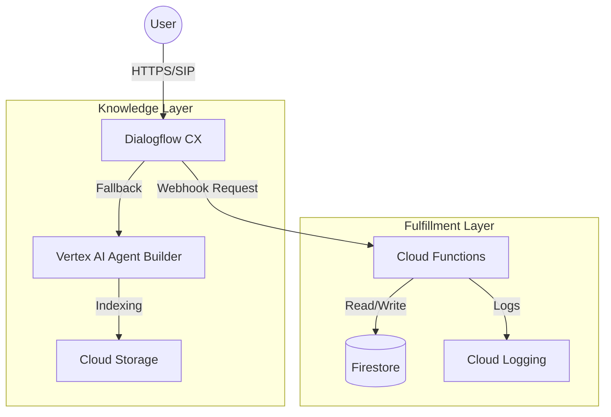

# AdGenius

AdGenius is a serverless conversational AI architecture designed to automate Tier-1 advertiser support and campaign lifecycle management.

It integrates **Dialogflow CX** for state-based NLU, **Google Cloud Functions** for backend fulfillment, and **Firestore** for persistent state management. The system utilizes a hybrid retrieval approach, routing transactional queries to deterministic handlers and unstructured policy queries to a RAG (Retrieval-Augmented Generation) pipeline via **Vertex AI**.

## System Architecture

The solution implements an event-driven architecture on Google Cloud Platform.

## Core Features

1. Stateful CRUD Operations

Unlike stateless FAQ bots, this agent maintains context across multi-turn flows to manage campaign resources.

    Create: Captures and validates multi-slot parameters (Campaign Name, Budget, Geo-Targeting) before writing to Firestore.

    Read: Fetches real-time performance metrics (CTR, Spend, Conversions).

    Update: Executing atomic writes to modify campaign budgets via authenticated intents.

2. Hybrid NLU Routing

The system employs a router pattern to handle disparate query types:

    Deterministic: High-risk actions (e.g., budget changes) are handled via strict intent matching and Python logic.

    Probabilistic (RAG): Compliance and policy queries are routed to Vertex AI Data Stores, synthesizing responses from ingested technical documentation (PDFs).

3. CI/CD & Reliability

    Infrastructure: Deployed via Google Cloud Functions (Gen 2).

    Pipeline: GitHub Actions workflow configured for automated testing and deployment upon push to the main branch.

    Normalization: Custom middleware handles input sanitization and case-insensitivity to ensure data integrity.

## Repository Structure

Plaintext

adgenius-cx-agent/
├── .github/workflows/
│   └── deploy.yml          # GitHub Actions deployment configuration
├── src/
│   └── main.py             # Application entry point and webhook logic
├── tests/
│   └── test_webhook.py     # Unit tests for intent handlers
├── requirements.txt        # Python dependencies
└── README.md               # Project documentation

## Setup and Installation

### Prerequisites

    Google Cloud Platform project with Billing enabled.

    Google Cloud SDK (gcloud) installed and authenticated.

    Python 3.11+.

### Local Development

    Clone the repository
    Bash

git clone [https://github.com/aywhoosh/adgenius-cx-agent.git](https://github.com/aywhoosh/adgenius-cx-agent.git)
cd adgenius-cx-agent

Install dependencies
Bash

pip install -r requirements.txt

Run with Functions Framework This simulates the Cloud Functions environment locally.
Bash

    functions-framework --target=dialogflow_webhook --debug

### Deployment

The project is configured for continuous deployment via GitHub Actions. To deploy manually from the CLI:
Bash

gcloud functions deploy adgenius-fulfillment \
    --gen2 \
    --runtime=python311 \
    --region=us-central1 \
    --source=. \
    --entry-point=dialogflow_webhook \
    --trigger-http \
    --allow-unauthenticated

## API Reference

The webhook expects a standard Dialogflow CX JSON payload.

Request Format:
JSON

{
  "fulfillmentInfo": {
    "tag": "create_campaign"
  },
  "sessionInfo": {
    "parameters": {
      "campaign_name": "Summer Sale",
      "budget": 5000
    }
  }
}

## License

This project is licensed under the MIT License - see the LICENSE file for details.